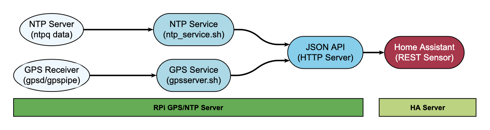
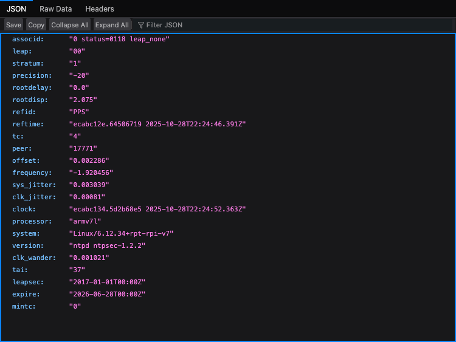
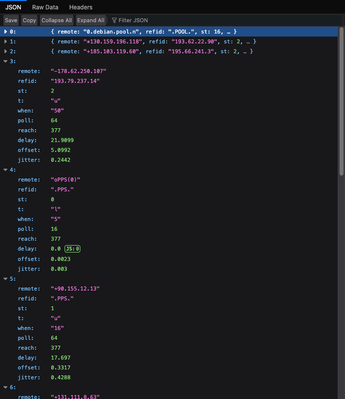
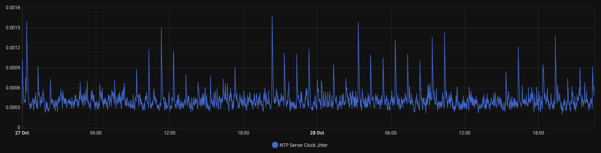
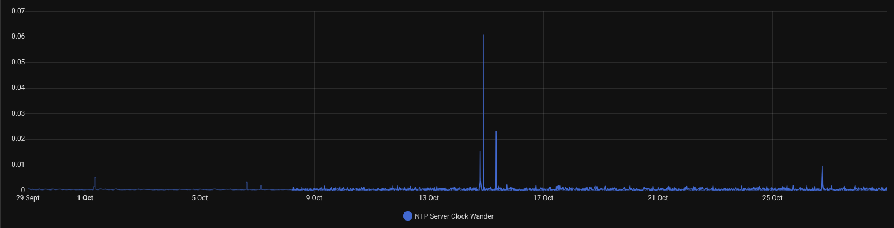
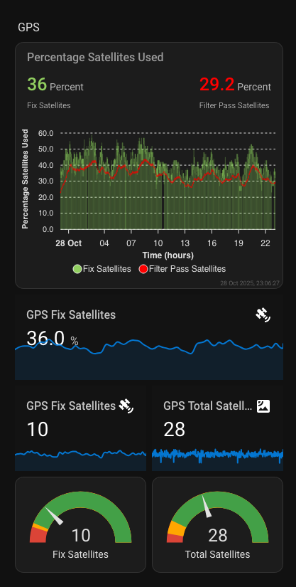

# NTP & GPS Home Bridge

This repository provides NTP and GPS monitoring systems for Home Assistant integration on Raspberry Pi.

## Architecture



## Installation

Download the installer script and review its contents before execution, as running unverified code from the internet is not recommended.

Run the installer as root:

```bash
sudo ./ntphomebridge.sh
```

The installer will check for and install required dependencies (NTP, GPSD, Python 3, jq, and a web server if not present), set up directories, copy scripts, configure systemd services, and start the NTP and GPS monitoring services.

## Usage

The services collect NTP and GPS data and serve JSON files at the following endpoints:

| Endpoint | Description | Data Type |
|----------|-------------|-----------|
| `http://<server_ip>/ntpq_crv.json` | NTP control variables including stratum, frequency, jitter, and precision metrics | NTP System Status |
| `http://<server_ip>/ntpq_pn.json` | NTP peer information showing synchronization sources and their status | NTP Peer Data |
| `http://<server_ip>/gps.json` | GPS satellite data including satellite positions, signal strength, and DOP values | GPS Satellite Data |

Configure Home Assistant REST sensors to consume these endpoints as described in the documentation.






## Directory Structure

```bash
/opt/ntphomebridge/
├── ntp_service.sh                 # NTP service script
├── gpsserver.sh                   # GPS service script
├── ntpq_crv_sensor.py            # CRV data parser
├── ntpq_pn_sensor.py             # Peer data parser
├── gps_sensor.py                 # GPS data processor
├── raw_ntpq_crv.txt              # Raw CRV output
├── raw_ntpq_pn.txt               # Raw peer output
├── gps.json                      # GPS data output
├── ntpq_crv.json                 # Processed CRV JSON
└── ntpq_pn.json                  # Processed peer JSON

/var/www/html/
├── ntpq_crv.json                 # Public CRV JSON endpoint
├── ntpq_pn.json                  # Public peer JSON endpoint
└── gps.json                      # Public GPS JSON endpoint
```


## Files

- `ntphomebridge.sh`: Installer script
- `ntp_service.sh`: NTP service script
- `gpsserver.sh`: GPS service script
- `scripts/ntpq_crv_sensor.py`: CRV data parser
- `scripts/ntpq_pn_sensor.py`: Peer data parser
- `scripts/gps_sensor.py`: GPS data processor
- `GPS_API_Implementation_Documentation.md`: GPS documentation
- `NTP_API_Implementation_Documentation.md`: NTP documentation
- `README.md`: This file
- `LICENSE`: MIT license


## Key Metrics Explained

### 1. Stratum
- **Description**: Indicates the distance from a reference clock
- **Values**: 0 (reference clock), 1 (directly connected), 2+ (network distance)
- **Monitoring**: Lower values indicate better time source quality

### 2. Frequency
- **Description**: Frequency offset in parts per million (PPM)
- **Values**: Typically -100 to +100 PPM
- **Monitoring**: Stable values indicate good oscillator performance

### 3. System Jitter
- **Description**: System clock jitter in seconds
- **Values**: Typically microseconds to milliseconds
- **Monitoring**: Lower values indicate more stable timing

### 4. Clock Jitter
- **Description**: Clock hardware jitter in seconds
- **Values**: Typically microseconds
- **Monitoring**: Hardware stability indicator

   

### 5. Clock Wander
- **Description**: Long-term frequency stability
- **Values**: Typically very small (< 0.001)
- **Monitoring**: Indicates oscillator aging and temperature effects



### 6. Precision
- **Description**: System clock precision (log₂ seconds)
- **Values**: Negative values (e.g., -20 = 2^-20 seconds ≈ 1 microsecond)
- **Monitoring**: Hardware capability indicator

## GPS Metrics Explained




### 1. Satellite Information
- **PRN**: Pseudo-Random Noise code (unique satellite identifier)
- **Elevation**: Angle above horizon (0-90 degrees)
- **Azimuth**: Angle from north (0-360 degrees)
- **SNR**: Signal strength/SNR (0-50+ dB)
- **Used**: Boolean indicating if satellite is used in position fix

### 2. Dilution of Precision (DOP) Values
- **HDOP**: Horizontal Dilution of Precision (position accuracy)
- **VDOP**: Vertical Dilution of Precision (altitude accuracy)
- **PDOP**: Position Dilution of Precision (3D position accuracy)
- **GDOP**: Geometric Dilution of Precision (time and position)

**DOP Guidelines:**
- < 1: Excellent
- 1-2: Good
- 2-5: Moderate
- 5-10: Fair
- > 10: Poor

### 3. Satellite Counts
- **Total Satellites**: Number of satellites in view
- **Used Satellites**: Number of satellites used in position calculation
- **Satellite Ratio**: Percentage of used vs visible satellites

## Security Considerations

1. **Firewall Configuration**: Only expose HTTP endpoints to trusted networks
2. **Authentication**: Consider adding basic auth for production deployments
3. **HTTPS**: Use HTTPS in production environments
4. **Rate Limiting**: Implement rate limiting to prevent abuse of your own system


## License
This project is licensed under the MIT License. See the [LICENSE](LICENSE) file for details.
