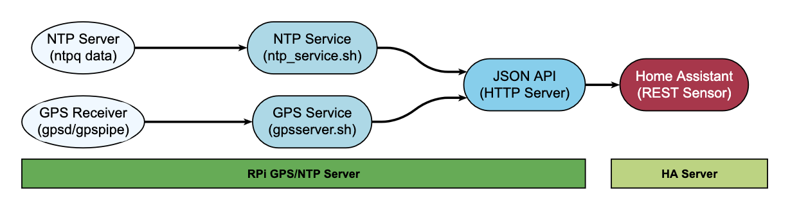
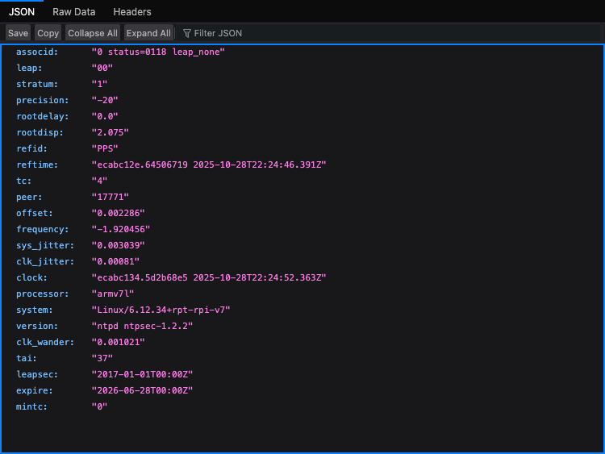
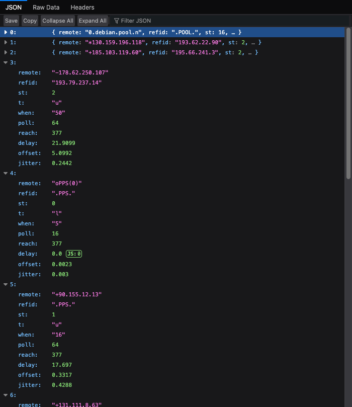
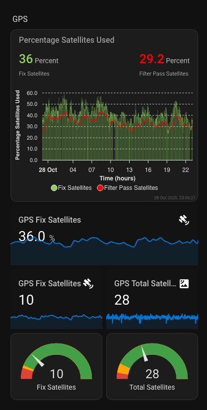
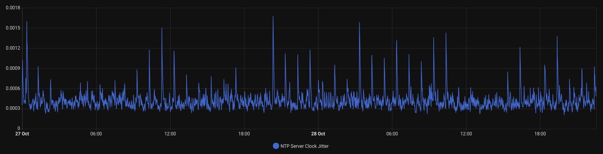
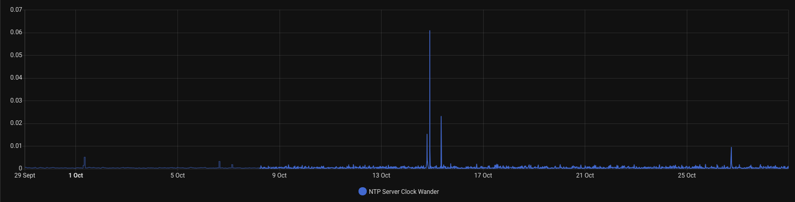

# NTP & GPS Home Bridge

[](https://github.com/ToledoEM/GPSNTPHomeBridge/actions/workflows/ci.yml)
[](https://codecov.io/gh/ToledoEM/GPSNTPHomeBridge)
[](LICENSE)
[](https://www.python.org/)
[](https://www.raspberrypi.com/)
[](https://www.home-assistant.io/integrations/rest/)

<p align="center">
  
</p>

Reads NTP and GPS status from a Raspberry Pi and serves it as JSON over HTTP, so Home Assistant can pick it up with REST sensors.

Built for the case where you already run a GPS-disciplined NTP server at home and want to see whether it is actually behaving: stratum, jitter, which peers are answering, how many satellites the receiver can see.

## Architecture



## Requirements

A Raspberry Pi running a Debian-based OS, a GPS receiver on a serial or USB port, and root access. The installer pulls in `ntp`, `gpsd`, `jq`, Python 3 and a web server if you do not already have one.

## Installation

Run this on the Pi that has the GPS receiver attached, not on your Home Assistant host.

Download the installer and read it before running it. It runs as root and installs packages:

```bash
curl -fsSLO https://raw.githubusercontent.com/ToledoEM/GPSNTPHomeBridge/main/gpsntphomebridge.sh
less gpsntphomebridge.sh
sudo bash gpsntphomebridge.sh
```

If you have already cloned the repository, run it directly:

```bash
sudo ./gpsntphomebridge.sh
```

It installs the dependencies, copies the collection scripts to `/opt/ntphomebridge/`, sets up two systemd services, and starts them. NTP data refreshes every 60 seconds, GPS every 15.

The installer clones the repository itself when it needs the collection scripts, so downloading the single file is enough to start.

### GPS device

The installer enables `gpsd` but leaves the device to you, since it depends on your hardware. Set it in `/etc/default/gpsd`:

```bash
DEVICES="/dev/ttyAMA0"     # or /dev/ttyUSB0, /dev/ttyACM0, ...
GPSD_OPTIONS="-n"
```

Restart with `sudo systemctl restart gpsd`. Check the receiver is talking before you expect anything on the GPS endpoint:

```bash
gpspipe -w -n 10
```

## Endpoints

| Endpoint | Contents |
|----------|----------|
| `http://<server_ip>/ntpq_crv.json` | Stratum, frequency, jitter, wander, precision, offset and the decoded status flags |
| `http://<server_ip>/ntpq_pn.json` | One entry per peer: address, tally code, stratum, reach, delay, offset, jitter |
| `http://<server_ip>/gps.json` | Satellite counts, per-constellation breakdown, average signal strength, DOP values and the raw satellite list |

Anyone who can reach the Pi can read these. Keep them on a trusted network, and put a reverse proxy with auth in front if you need more than that.





## Home Assistant

Two ways to get the data in. The custom integration sets everything up from the UI and is the easier option. The REST sensor YAML below still works if you would rather configure it by hand.

### Custom integration

In HACS, add `https://github.com/ToledoEM/GPSNTPHomeBridge` as a custom repository with category **Integration**, download it, and restart Home Assistant. Then add it under **Settings, Devices & services, Add integration**, search for *GPS & NTP Home Bridge*, and enter the address of the Pi.

It creates a device with sensors for stratum, frequency, system and clock jitter, clock wander, offset, precision, the synced peer and peer reachability, plus satellite counts, satellite ratio, average signal strength, HDOP and the fix timestamp. Peer details and the per-constellation breakdown are attached as attributes.

The integration polls at the same rate the services refresh: NTP every 60 seconds, GPS every 15.

### REST sensors

Add these to `configuration.yaml`, then restart Home Assistant. Replace `YOUR_SERVER_IP` with the address of your Pi.

#### NTP

```yaml
sensor:
  - platform: rest
    name: ntp_server_status
    unique_id: ntp_server_status
    resource: http://YOUR_SERVER_IP/ntpq_crv.json
    value_template: "{{ value_json.stratum }}"
    method: GET
    verify_ssl: false
    timeout: 30
    force_update: true
    scan_interval: 60
    json_attributes:
      - stratum
      - frequency
      - sys_jitter
      - clk_jitter
      - clk_wander
      - precision
      - offset
      - refid
      - status
      - status_flags
```

The sensor state is the stratum. Everything else lands in attributes. `status_flags` holds the decoded words from the `ntpq` status line, such as `leap_none`, `sync_ntp` and `clock_sync`.

#### GPS

```yaml
sensor:
  - platform: rest
    name: gps_server
    unique_id: gps_server
    resource: http://YOUR_SERVER_IP/gps.json
    value_template: "{{ value_json.used_satellites }}"
    method: GET
    verify_ssl: false
    timeout: 30
    force_update: true
    scan_interval: 30
    json_attributes:
      - total_satellites
      - used_satellites
      - satellite_ratio
      - avg_signal_strength
      - gnss_breakdown
      - dop_values
      - timestamp
      - satellites
```

The counts, constellation breakdown and average signal strength arrive precomputed, so read them as attributes instead of recalculating them in a template.

#### Template sensors

Split the attributes into their own entities if you want to graph them:

```yaml
template:
  - sensor:
      - name: "NTP Server Stratum"
        state: "{{ state_attr('sensor.ntp_server_status', 'stratum') }}"
        unique_id: "ntp_server_stratum"
        state_class: measurement
        icon: mdi:server-network

      - name: "NTP Server Frequency"
        state: "{{ state_attr('sensor.ntp_server_status', 'frequency') }}"
        unique_id: "ntp_server_frequency"
        state_class: measurement
        icon: mdi:speedometer

      - name: "NTP Server System Jitter"
        state: "{{ state_attr('sensor.ntp_server_status', 'sys_jitter') }}"
        unique_id: "ntp_server_sys_jitter"
        state_class: measurement
        icon: mdi:chart-line

      - name: "NTP Server Clock Jitter"
        state: "{{ state_attr('sensor.ntp_server_status', 'clk_jitter') }}"
        unique_id: "ntp_server_clk_jitter"
        state_class: measurement
        icon: mdi:clock

      - name: "NTP Server Clock Wander"
        state: "{{ state_attr('sensor.ntp_server_status', 'clk_wander') }}"
        unique_id: "ntp_server_clk_wander"
        state_class: measurement
        icon: mdi:clock-alert

      - name: "NTP Server Precision"
        state: "{{ state_attr('sensor.ntp_server_status', 'precision') }}"
        unique_id: "ntp_server_precision"
        state_class: measurement
        icon: mdi:target

      - name: "used_satellites"
        state: "{{ state_attr('sensor.gps_server', 'used_satellites') }}"
        unique_id: "used_satellites"
        state_class: measurement
        icon: mdi:satellite-variant

      - name: "total_satellites"
        state: "{{ state_attr('sensor.gps_server', 'total_satellites') }}"
        unique_id: "total_satellites"
        state_class: measurement
        icon: mdi:satellite-variant

      - name: "signal_strength"
        state: "{{ state_attr('sensor.gps_server', 'avg_signal_strength') }}"
        unique_id: "signal_strength"
        state_class: measurement
        unit_of_measurement: dBHz
        icon: mdi:signal-variant

      - name: "satellite_ratio"
        state: "{{ state_attr('sensor.gps_server', 'satellite_ratio') | round(1) }}"
        unique_id: "satellite_ratio"
        state_class: measurement
        unit_of_measurement: "%"
        icon: mdi:percent

      - name: "glonass_satellites"
        state: "{{ (state_attr('sensor.gps_server', 'gnss_breakdown') or {}).get('glonass', 0) }}"
        unique_id: "glonass_satellites"
        state_class: measurement
        icon: mdi:satellite-variant

      - name: "gps_hdop"
        state: "{{ (state_attr('sensor.gps_server', 'dop_values') or {}).get('hdop', 0) }}"
        unique_id: "gps_hdop"
        state_class: measurement
        icon: mdi:crosshairs-gps
```

gpsd reports signal strength in dB-Hz, not dBm.

#### Dashboard

```yaml
type: entities
title: NTP & GPS Monitoring
entities:
  - entity: sensor.ntp_server_stratum
  - entity: sensor.ntp_server_clock_jitter
  - entity: sensor.used_satellites
  - entity: sensor.total_satellites
  - entity: sensor.signal_strength
  - entity: sensor.gps_hdop
```

These entity IDs come from the `name:` values above. Rename a sensor and the card needs the same change.



## Reading the numbers

### NTP

`stratum` is how far you sit from a reference clock. A working GPS setup should read 1, meaning the Pi is attached to one directly. 2 or more means it fell back to syncing over the network. 16 means it gave up and is not synchronised at all.

`frequency` is the correction applied to the local oscillator in parts per million, usually somewhere between -100 and +100. The absolute number matters less than whether it holds still. Steady drift usually turns out to be temperature.

`sys_jitter` and `clk_jitter` measure short-term instability in seconds, normally microseconds to milliseconds, and lower is better. The first covers the time source as a whole, the second only the local hardware.



`clk_wander` tracks stability over longer periods and usually stays under 0.001. Expect it to creep up as an oscillator ages or the room warms.



`precision` is clock resolution as a power of two. -20 works out to 2^-20 seconds, near enough a microsecond.

`reach` records whether each of the last eight polls got an answer, served as a decimal number. 255 means all eight landed, 0 means the peer has gone quiet, and anything between means you are dropping responses.

`tally` is the verdict `ntpq` reached about each peer: `*` for the one in use, `+` for a viable candidate, `-` for an outlier it threw out, blank for one it is ignoring.

### GPS

Every satellite reports `PRN` as its identifier, `el` for degrees above the horizon, `az` for degrees from north, `ss` for signal strength in dB-Hz, and `used` for whether it fed into the current fix.

`satellite_ratio` is the share of visible satellites that made it into the fix. `gnss_breakdown` splits the count across GPS, GLONASS, Galileo, BeiDou, QZSS, SBAS, IMES and NavIC.

The DOP figures describe how much satellite geometry is hurting accuracy: `hdop` for horizontal position, `vdop` for altitude, `pdop` for the 3D fix, `gdop` for position and time together. Under 1 is excellent, 1 to 2 is good, 2 to 5 is workable, and past 10 there is not much point trusting it.

## License

MIT. See [LICENSE](LICENSE).
